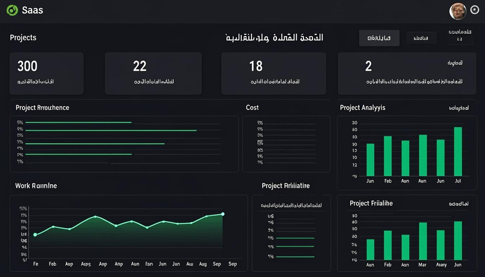
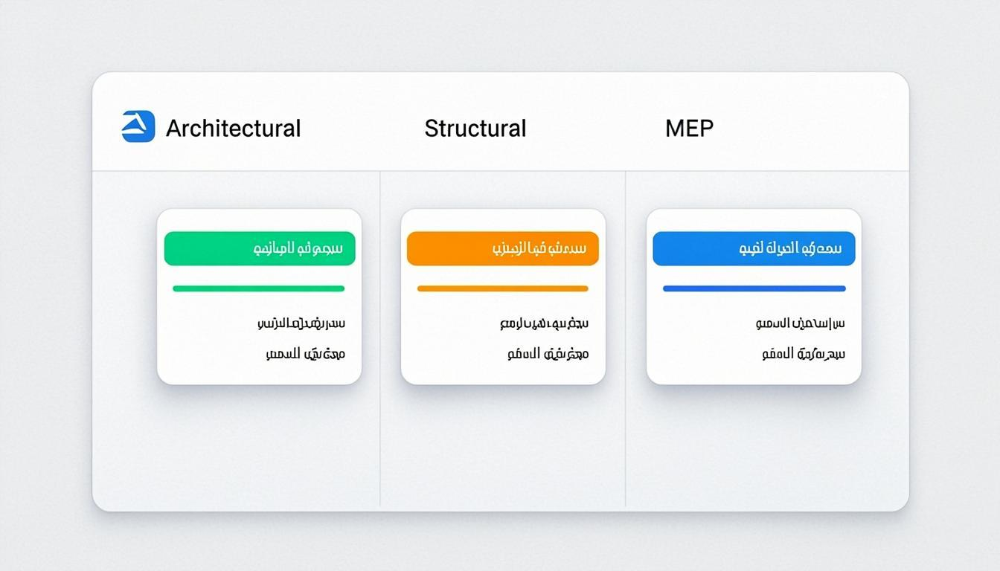
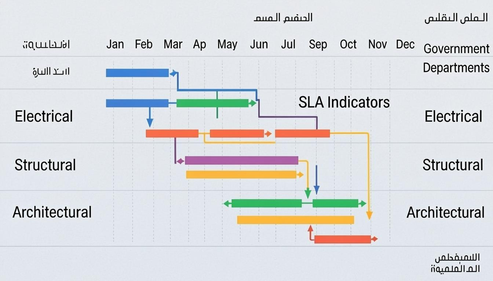
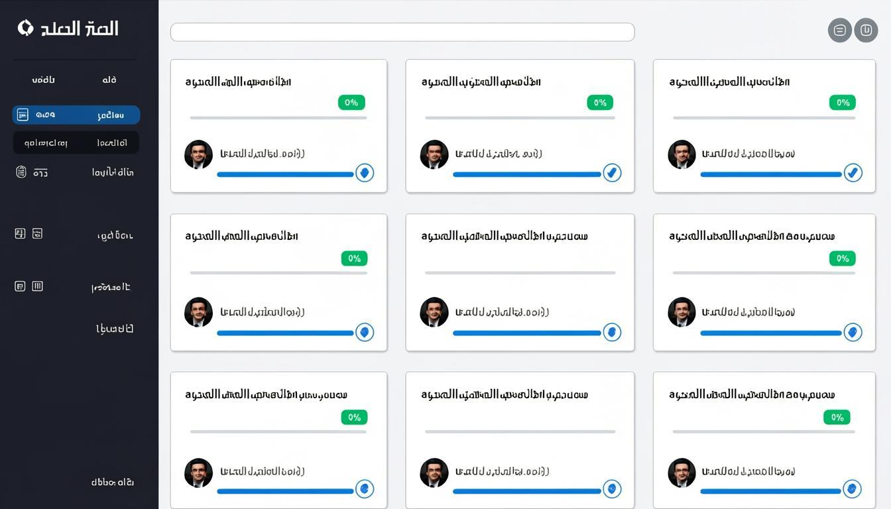
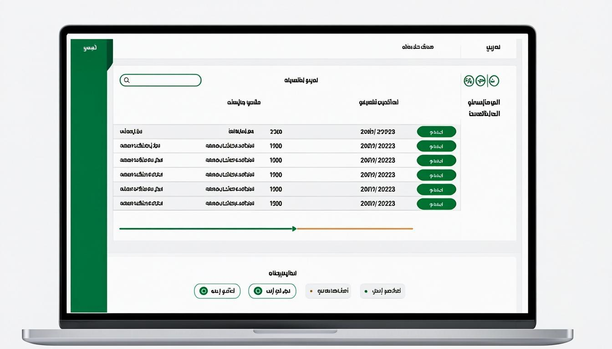

# BluePrint SaaS - نظام إدارة مكاتب الاستشارات الهندسية

<div align="center">
  

  <h3>منصة متكاملة لإدارة مشاريع البناء والاستشارات الهندسية</h3>
  <p><strong>Construction & Engineering Consultancy Management Platform</strong></p>

  [](https://nextjs.org/)
  [](https://www.typescriptlang.org/)
  [](https://react.dev/)
  [](https://www.prisma.io/)
  [](https://www.postgresql.org/)
  [](https://tailwindcss.com/)
  [](https://ui.shadcn.com/)
  [](LICENSE)

  [English](#english) | [العربية](#العربية)
</div>

---

## العربية

### 📋 نظرة عامة

BluePrint SaaS هي منصة شاملة لإدارة مشاريع البناء والاستشارات الهندسية، مصممة خصيصاً لمكاتب الاستشارات الهندسية في منطقة الخليج العربي. تدعم المنصة كامل دورة حياة المشروع من الزيارة الأولى للعميل حتى الحصول على رخصة البناء والبدء في التنفيذ.

### 🏗️ المميزات الرئيسية

#### إدارة المشاريع الشاملة
- **تتبع معلومات المشروع**: رقم المشروع، رقم ملف العميل، اسم العميل، رقم القسيمة، الموقع، نوع المشروع، تاريخ الزيارة
- **مراحل التصميم المعماري**: من السكتش المبدئي إلى المخططات النهائية (10 مراحل)
- **المخططات الإنشائية**: القواعد، الكمرات، الأعمدة، البلاطات، الدرج، نمذجة ETABS (10 مراحل)
- **أعمال الكهرباء (MEP)**: الكهرباء، التكييف، الصرف الصحي، إمدادات المياه، الاتصالات، الدفاع المدني
- **الموافقات الحكومية**: جمع المستندات، تقديم البلدية، التحديد والتسوية، استخراج الرخصة (10 مراحل)
- **المناقصات**: إدارة المقاولين وحاويات الأشغال

#### نظام الجدول الزمني (Timeline)
- **جداول زمنية قياسية** لكل قسم (43 يوم إجمالي / 50 يوم كحد أقصى)
- **SLA تلقائي** لكل مرحلة مع تنبيهات عند التجاوز
- **مخطط جانت (Gantt Chart)** لعرض التبعيات بين المراحل

#### تتبع المخططات
- **حالات فردية** لكل مخطط: لم يبدأ / قيد التنفيذ / مقدم للمراجعة / معتمد / مرفوض
- **نسب إكمال تلقائية** تُحسب من عدد المخططات المكتملة
- **عدد مرات الرفض** وملاحظات البلدية لكل قسم
- **تعيين المهندسين والرسامين** مع تواريخ البدأ والانتهاء

#### إدارة الأعمال
| الميزة | الوصف |
|--------|-------|
| 💰 الفواتير والعروض | إنشاء وتتبع الفواتير والعروض المالية |
| 📋 كميات الأعمال | BOQ - جداول كميات الأسعار |
| 👥 الموارد البشرية | إدارة الموظفين والحضور والإجازات |
| 📝 المراسلات | مراسلات البلدية والجهات الحكومية |
| 🔍 تقارير زيارة الموقع | تقرير تفصيلي بكل أقسام الموقع |
| 🤝 إدارة العقود | إنشاء وتتبع العقود |
| 📊 التقارير والتحليلات | لوحات تحكم وتقارير تفصيلية |
| 🤖 مساعد ذكي (AI) | مساعد ذكي للإجابة على الأسئلة |

#### نظام الصلاحيات (9 أدوار)
| الدور | الوصف |
|------|-------|
| `ADMIN` | مدير النظام - صلاحيات كاملة |
| `MANAGER` | مدير - إدارة المشاريع والفرق |
| `PROJECT_MANAGER` | مدير مشروع - إدارة مشروع واحد |
| `ENGINEER` | مهندس - العمل على التصميمات |
| `DRAFTSMAN` | رسام - الرسم والمخططات |
| `ACCOUNTANT` | محاسب - الفواتير والتقارير المالية |
| `HR` | موارد بشرية - الموظفين والإجازات |
| `SECRETARY` | سكرتارية - المستندات والمراسلات |
| `VIEWER` | مشاهد - عرض فقط |

### 🛠️ التقنيات المستخدمة

| الفئة | التقنية |
|-------|---------|
| **Framework** | Next.js 16 (App Router) + React 19 |
| **Language** | TypeScript 5 |
| **Database** | PostgreSQL 16 + Prisma 6 ORM (51 نموذج) |
| **Authentication** | NextAuth.js v4 + JWT + 2FA (TOTP) |
| **State Management** | TanStack Query v5 + Zustand |
| **UI Components** | shadcn/ui (50+ مكون) + Radix UI + Tailwind CSS 4 |
| **Charts** | Recharts |
| **Animations** | Framer Motion |
| **Real-time** | Socket.io |
| **Cache** | Redis |
| **Payments** | Stripe |
| **AI Integration** | z-ai-web-dev-sdk |
| **Testing** | Jest + Playwright (E2E) |
| **CI/CD** | GitHub Actions (8 Workflows) |
| **Deployment** | Docker + Vercel + Netlify |

### 📊 إحصائيات المشروع

| المقياس | القيمة |
|--------|--------|
| ملفات الكود المصدري | 471+ ملف |
| أسطر الكود | 125,000+ سطر |
| نماذج قاعدة البيانات | 51 نموذج |
| الأنواع المعدودة (Enums) | 43 نوع |
| صفحات لوحة التحكم | 37 صفحة |
| مسارات API | 50+ مسار |
| مكونات React | 60+ مكون |
| GitHub Actions | 8 Workflows |

### 📸 لقطات الشاشة

#### لوحة التحكم الرئيسية


#### مساحة العمل - تتبع المراحل


#### مخطط جانت - الجدول الزمني


#### إدارة المشاريع


#### نظام الفواتير


### 🚀 البدء السريع

#### المتطلبات
- Node.js 20+
- PostgreSQL 16+
- npm أو bun

#### التثبيت

```bash
# 1. استنساخ المستودع
git clone https://github.com/mohamedblueprintrak-design/BluePrint.git
cd BluePrint

# 2. تثبيت التبعيات
npm install

# 3. إعداد متغيرات البيئة
cp .env.example .env
# قم بتعديل ملف .env بالقيم المناسبة

# 4. إعداد قاعدة البيانات
npx prisma migrate dev
npx prisma generate
npx prisma db seed

# 5. تشغيل التطبيق
npm run dev
```

افتح [http://localhost:3000](http://localhost:3000) في المتصفح.

### 📁 هيكل المشروع

```
blueprint-saas/
├── src/
│   ├── app/                          # Next.js App Router
│   │   ├── api/                      # API Routes (50+ endpoints)
│   │   │   ├── auth/                 # المصادقة والتفويض
│   │   │   ├── projects/             # إدارة المشاريع
│   │   │   ├── tasks/                # إدارة المهام
│   │   │   ├── clients/              # إدارة العملاء
│   │   │   ├── invoices/             # الفواتير
│   │   │   ├── contracts/            # العقود
│   │   │   ├── bidding/              # المناقصات
│   │   │   ├── meetings/             # الاجتماعات
│   │   │   ├── documents/            # المستندات
│   │   │   ├── workflow/             # سير العمل والمراحل
│   │   │   ├── municipality-correspondence/  # مراسلات البلدية
│   │   │   ├── site-visit-reports/   # تقارير زيارة الموقع
│   │   │   ├── ai-chat/              # المساعد الذكي
│   │   │   └── ...
│   │   ├── dashboard/                # صفحات لوحة التحكم (37 صفحة)
│   │   │   ├── projects/             # المشاريع ومساحة العمل
│   │   │   ├── tasks/                # المهام
│   │   │   ├── invoices/             # الفواتير
│   │   │   ├── clients/              # العملاء
│   │   │   ├── contracts/            # العقود
│   │   │   ├── boq/                  # كميات الأعمال
│   │   │   ├── bidding/              # المناقصات
│   │   │   ├── meetings/             # الاجتماعات
│   │   │   ├── reports/              # التقارير
│   │   │   ├── hr/                   # الموارد البشرية
│   │   │   ├── finance/              # الشئون المالية
│   │   │   ├── documents/            # المستندات
│   │   │   ├── settings/             # الإعدادات
│   │   │   ├── ai-chat/              # المساعد الذكي
│   │   │   └── ...
│   │   └── login/                    # تسجيل الدخول
│   │
│   ├── components/                   # مكونات React (60+)
│   │   ├── ui/                       # shadcn/ui (50+ مكون أساسي)
│   │   ├── layout/                   # التخطيط والشريط الجانبي
│   │   ├── dashboard/                # مكونات لوحة التحكم
│   │   │   ├── project-workspace/    # مساحة العمل
│   │   │   │   ├── tabs/             # 14 تاب: Architecture, Structural, MEP, Government, ...
│   │   │   │   └── config.tsx        # إعدادات المراحل والأنواع
│   │   │   └── charts/               # المخططات البيانية
│   │   ├── projects/                 # مكونات المشاريع
│   │   ├── invoices/                 # مكونات الفواتير
│   │   ├── gantt/                    # مخطط جانت
│   │   └── ...
│   │
│   ├── lib/                          # المكتبات والأدوات
│   │   ├── auth/                     # المصادقة والتفويض
│   │   ├── repositories/             # طبقة الوصول للبيانات
│   │   ├── services/                 # منطق الأعمال
│   │   └── validations/              # التحقق من البيانات
│   │
│   └── types/                        # TypeScript Types
│
├── prisma/
│   ├── schema.prisma                 # مخطط قاعدة البيانات (51 نموذج, 1829 سطر)
│   ├── migrations/                   # ملفات الهجرة
│   └── seed.ts                       # بيانات البذرة
│
├── e2e/                              # اختبارات E2E (Playwright)
├── __tests__/                        # اختبارات الوحدة (Jest)
├── .github/workflows/                # GitHub Actions (8 Workflows)
├── docker-compose.yml                # Docker Compose
├── Dockerfile                        # Docker للإنتاج
└── docs/
    ├── screenshots/                  # لقطات الشاشة
    ├── openapi-spec.yaml             # OpenAPI Specification
    └── AUDIT_REPORT.md               # تقرير التدقيق الأمني
```

### 🔐 المصادقة والأمان

- **JWT + NextAuth.js** مع تجديد تلقائي
- **2FA (TOTP)** للمصادقة الثنائية
- **نظام صلاحيات دقيق** (43 نوع صلاحية)
- **تشفير البيانات الحساسة** (AES-256)
- **Rate Limiting** للحماية من الهجمات
- **CORS Configuration** للإنتاج

### 🐳 Docker Deployment

```bash
# تشغيل بالحاويات
docker-compose up -d

# بناء للإنتاج
docker-compose -f docker-compose.yml -f docker-compose.prod.yml up -d

# عرض السجلات
docker-compose logs -f
```

### 🤝 المساهمة

نرحب بالمساهمات! يرجى اتباع الخطوات التالية:

1. Fork المشروع
2. إنشاء فرع جديد (`git checkout -b feature/amazing-feature`)
3. عمل التغييرات
4. التأكد من اجتياز الاختبارات (`npm run lint && npm run test`)
5. رفع التغييرات (`git push origin feature/amazing-feature`)
6. فتح Pull Request

---

## English

### Overview

BluePrint SaaS is a comprehensive construction and engineering consultancy management platform, designed specifically for engineering consultancy offices in the Gulf region. The platform supports the full project lifecycle from the initial client visit through building permit acquisition and construction start.

### Key Features

#### Comprehensive Project Management
- **Project Information Tracking**: Project number, client file number, client name, plot number, location, project type, visit date
- **Architectural Design Phases**: From initial sketches to final drawings (10 phases)
- **Structural Drawings**: Foundations, beams, columns, slabs, stairs, ETABS modeling (10 phases)
- **MEP Works**: Electrical, HVAC, drainage, water supply, telecom, civil defense
- **Government Approvals**: Document collection, municipality submission, demarcation, license issuance (10 phases)
- **Tendering**: Contractor management and work containers

#### Timeline System
- **Standard timelines** per department (43 days total / 50 days maximum)
- **Automatic SLA** per phase with breach alerts
- **Gantt Chart** for phase dependencies visualization

#### Drawing Tracking
- **Individual status** per drawing: Not Started / In Progress / Submitted / Approved / Rejected
- **Auto-calculated completion** percentages
- **Rejection count** and municipality notes per department
- **Engineer & draftsman assignment** with start/end dates

#### Business Management
| Feature | Description |
|---------|-------------|
| 💰 Invoices & Proposals | Create and track invoices and financial proposals |
| 📋 Bill of Quantities | BOQ - Price quantity schedules |
| 👥 Human Resources | Employee management, attendance, leave requests |
| 📝 Correspondence | Municipality and government entity correspondence |
| 🔍 Site Visit Reports | Detailed site inspection reports |
| 🤝 Contract Management | Create and track contracts |
| 📊 Reports & Analytics | Dashboards and detailed reports |
| 🤖 AI Assistant | Intelligent assistant for answering questions |

### Tech Stack

| Category | Technology |
|----------|------------|
| **Framework** | Next.js 16 (App Router) + React 19 |
| **Language** | TypeScript 5 |
| **Database** | PostgreSQL 16 + Prisma 6 ORM (51 models) |
| **Authentication** | NextAuth.js v4 + JWT + 2FA (TOTP) |
| **State Management** | TanStack Query v5 + Zustand |
| **UI Components** | shadcn/ui (50+ components) + Radix UI + Tailwind CSS 4 |
| **Charts** | Recharts |
| **Animations** | Framer Motion |
| **Real-time** | Socket.io |
| **Payments** | Stripe |
| **Testing** | Jest + Playwright |
| **CI/CD** | GitHub Actions (8 Workflows) |

### Quick Start

```bash
git clone https://github.com/mohamedblueprintrak-design/BluePrint.git
cd BluePrint
npm install
cp .env.example .env
# Edit .env with your values
npx prisma migrate dev
npx prisma generate
npx prisma db seed
npm run dev
```

Open [http://localhost:3000](http://localhost:3000)

### Contributing

Contributions are welcome! Please follow these steps:

1. Fork the repository
2. Create a feature branch (`git checkout -b feature/amazing-feature`)
3. Make your changes
4. Ensure tests pass (`npm run lint && npm run test`)
5. Push changes (`git push origin feature/amazing-feature`)
6. Open a Pull Request

---

## 📄 License

This project is licensed under the [MIT License](LICENSE).

---

<div align="center">
  <p><strong>صنع بـ ❤️ لخدمة مكاتب الاستشارات الهندسية</strong></p>
  <p>Built with ❤️ for Engineering Consultancy Offices</p>
</div>
